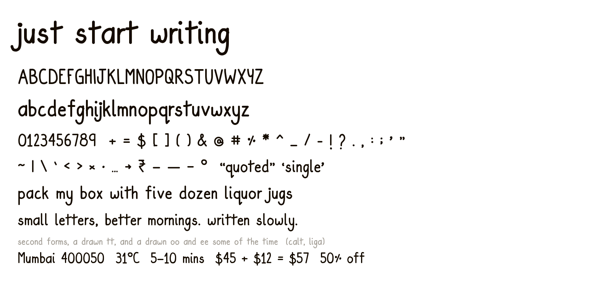

# Su Hand

My handwriting, as a real font. Every letter is a stroke I actually drew, not a redrawn or smoothed version of one.



This repo is the built font only, published so my projects can pull one copy. The source, the drawings and the build live elsewhere.

## Use it on the web

Via CDN, no install:

```css
@font-face {
  font-family: "Su Hand";
  src: url("https://cdn.jsdelivr.net/gh/suhaniashok/su-hand@v2.1.1/dist/SuHand-Regular.woff2") format("woff2");
  font-weight: 400;
  font-style: normal;
  font-display: swap;
}
```

Or install it and serve it yourself:

```
npm install github:suhaniashok/su-hand
```

```css
@font-face {
  font-family: "Su Hand";
  src: url("~su-hand/dist/SuHand-Regular.woff2") format("woff2");
  font-display: swap;
}
```

Pin the tag rather than tracking `main`, so a rebuild never moves type under a live page.

## Setting it

```css
.handwriting {
  font-family: "Su Hand", cursive;
  line-height: 1.5;
  font-synthesis: none;
}
```

Two things worth knowing:

- **`font-synthesis: none`.** There is no bold and no italic. Without this, a `<strong>` or a `font-weight: 700` makes the browser fake one by smearing the strokes, which looks bad on a face this irregular. Set weight and emphasis some other way.
- **Give it line height.** 1.37 em of ink against a 1.21 em norm. The ascenders and descenders are long relative to the x-height, so 1.5 or more.

Nothing needs enabling. The alternates (`calt`) and the kerning (`kern`) are both on by default in every browser.

## What's in it

- **a-z**, **A-Z**, **0-9**
- **Punctuation**: `- ! ? ' " . , : ; # % ( ) [ ] / & @ _ * ^ + = $`, plus smart quotes, so `'` `'` `"` `"` resolve to the marks I drew rather than falling back
- **Alternates that fire on their own.** I wrote `t` four times, `r` three times, and `a` `e` `i` `n` `o` `s` twice each, so a repeat inside a word steps to the next form. "letter" gets two different `t`s, "toronto" gets three different `o`s, "keen" gets two different `e`s. This is the single thing that stops a handwriting font reading as fake.
- **Kerning**, 4,442 pairs, measured off the outlines rather than chosen by hand
- 100 glyphs, 93 codepoints

Capitals sit at 0.891 em against a 0.545 em x-height. That is a taller ratio than a text face, because it is what my writing does, so ALL CAPS reads large and wants a size down.

## Files

| | |
|---|---|
| `dist/SuHand-Regular.woff2` | web, 22K |
| `dist/SuHand-Regular.otf` | Mac, Figma, desktop |
| `dist/SuHand-Regular.ttf` | iOS and Android bundles |

To install it on a Mac, double-click the `.otf` and hit "Install Font".

## Licence

© Suhani Ashok. All rights reserved.

Public so my own projects can fetch it. It is my handwriting, so please don't use it as your own; if you want to use it for something, ask me.
