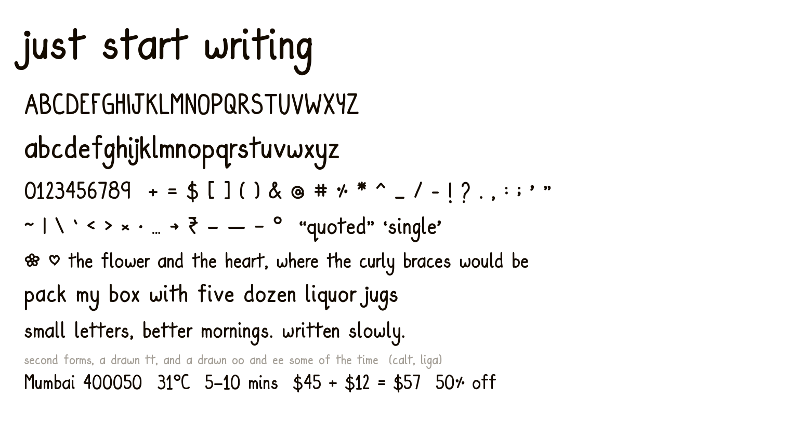

# Su Hand

My handwriting, as a real font. Every letter is a stroke I actually drew, not a redrawn or smoothed version of one.



**[See it set &rarr;](https://suhaniashok.github.io/su-hand/)**

This repo is the built font only, published so my projects can pull one copy. The source, the drawings and the build live elsewhere.

## Use it on the web

Via CDN, no install:

```css
@font-face {
  font-family: "Su Hand";
  src: url("https://cdn.jsdelivr.net/gh/suhaniashok/su-hand@v1.0.0/dist/SuHand-Regular.woff2") format("woff2");
  font-weight: 400;
  font-style: normal;
  font-display: swap;
}
```

Or install it and serve it yourself:

```
npm install github:suhaniashok/su-hand
```

```css
@font-face {
  font-family: "Su Hand";
  src: url("~su-hand/dist/SuHand-Regular.woff2") format("woff2");
  font-display: swap;
}
```

Pin the tag rather than tracking `main`, so a rebuild never moves type under a live page.

## Setting it

```css
.handwriting {
  font-family: "Su Hand", cursive;
  line-height: 1.5;
  font-synthesis: none;
}
```

Two things worth knowing:

- **`font-synthesis: none`.** There is no bold and no italic. Without this, a `<strong>` or a `font-weight: 700` makes the browser fake one by smearing the strokes, which looks bad on a face this irregular. Set weight and emphasis some other way.
- **Give it line height.** 1.37 em of ink against a 1.21 em norm. The ascenders and descenders are long relative to the x-height, so 1.5 or more.

Nothing needs enabling. The alternates (`calt`) and the kerning (`kern`) are both on by default in every browser.

## What's in it

- **a-z**, **A-Z**, **0-9**
- **Punctuation**: `- ! ? ' " . , : ; # % ( ) [ ] / & @ _ * ^ + = $` and ``~ | \ ` < > × · … → ₹ – — − °``, plus smart quotes, so `'` `'` `"` `"` resolve to the marks I drew rather than falling back. Opening and closing quotes are separate marks, so a quotation curls the right way round at both ends.
- **Alternates that fire on their own.** Every letter is drawn twice and `a` `e` `o` three times, each form a separate stroke off the pen rather than the same one reused, so a repeat inside a word steps to the next form. "will" gets two different `l`s, "letter" two different `t`s, "keen" two different `e`s. This is the single thing that stops a handwriting font reading as fake.
- **You can also pick a form by hand.** The automatic rule only steps a *repeat*, so a letter that turns up once in a word never reaches its other form, which shows the moment you set a single word as a heading. `font-feature-settings: "salt" 1` takes the second form, `"ss02" 1` the third for `a` `e` `o`.
- **Three drawn pairs**, `tt` `oo` `ee`, joined by the stroke that runs out of one letter and into the next, which is what my hand does at speed and what no amount of kerning can produce. `tt` fires everywhere; `oo` and `ee` are a flourish, so they turn up on about one in six and one in four.
- **Kerning**, 9,084 pairs, measured off the outlines rather than chosen by hand
- 139 glyphs, 110 codepoints

Capitals sit at 0.891 em against a 0.545 em x-height. That is a taller ratio than a text face, because it is what my writing does, so ALL CAPS reads large and wants a size down.

## Files

| | |
|---|---|
| `dist/SuHand-Regular.woff2` | web, 34K |
| `dist/SuHand-Regular.otf` | Mac, Figma, desktop |
| `dist/SuHand-Regular.ttf` | iOS and Android bundles |

To install it on a Mac, double-click the `.otf` and hit "Install Font".

## Licence

© Suhani Ashok.

**Free for personal use. Ask me before anything commercial.** Install it and
set what you like with it for yourself; open an issue before using it for a
client, a product, a brand or anything that earns money. Please do not
redistribute the files, host your own copy, or alter the outlines.

Full terms in [LICENCE.md](LICENCE.md).
